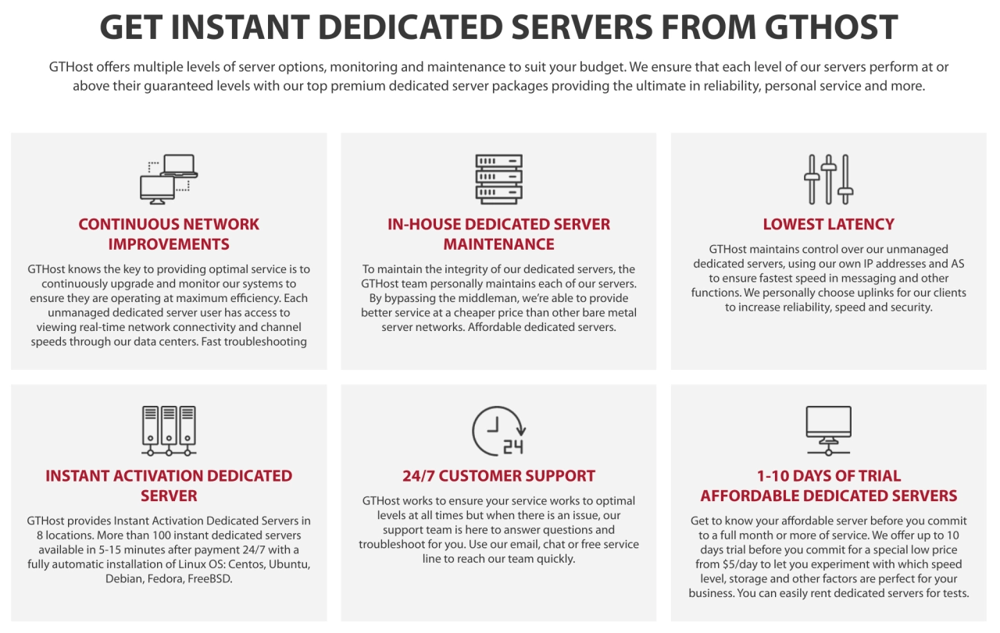
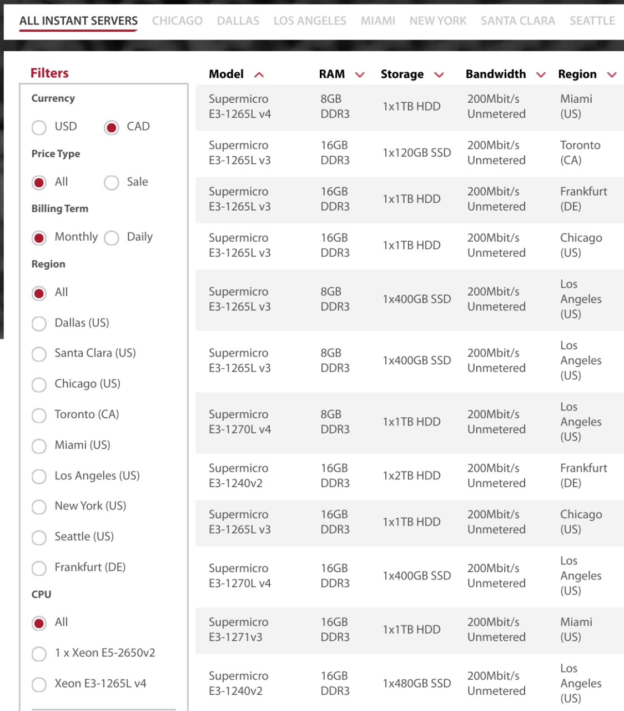
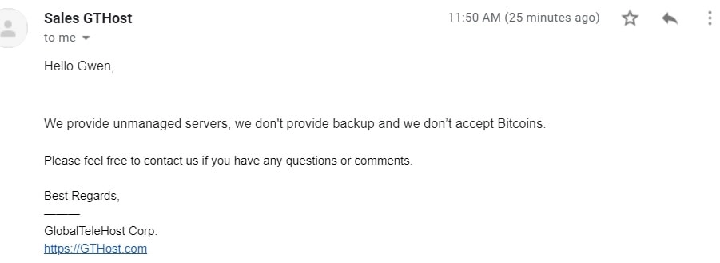

# GTHost Servers: Budget-Friendly Global Dedicated Server Solutions

---

Looking for affordable yet powerful dedicated servers worldwide? GTHost (GlobalTeleHost Corp.) delivers enterprise-grade hardware across 20+ strategic data center locations spanning North America, Europe, and beyond—without the premium price tag. Whether you need lightning-fast deployment, 100% network uptime guarantee, or flexible control panel options, GTHost provides instant server provisioning in under 15 minutes with transparent pricing and no hidden fees.

---

Founded in 2012, GlobalTeleHost Corp. (GTHost) has built its reputation on delivering premium dedicated servers and network infrastructure at competitive prices. This Canadian hosting provider operates data centers in major cities including Toronto, Frankfurt, Chicago, Los Angeles, Miami, New York, Dallas, Seattle, and Santa Clara. The company's philosophy is simple: enterprise-grade hardware with absolute transparency and no surprises.

## Features and Usability

GTHost offers **over 100 instant dedicated servers** across **eight primary data center locations**. These servers become **operational within 15 minutes of payment**, with automatic installation of your chosen **Linux distribution** (Debian, CentOS, Ubuntu, FreeBSD, or Fedora) and **preferred control panel** (Vesta, Plesk, DirectAdmin, ISPManage, or cPanel).

Every dedicated server includes **Intelligent Platform Management Interface (IPMI)** for remote hardware health monitoring and management. Key specifications include:

- Supermicro blade chassis architecture
- Xeon CPU processors
- Storage options: 1TB HDD or 120GB SSD
- 200 Mbps unlimited bandwidth
- Up to 16GB DDR4 RAM

**Full root access** gives you complete control over your server environment. Whether you're running web applications, databases, or development environments, 👉 [discover how GTHost's instant provisioning and enterprise hardware can accelerate your deployment timeline](https://cp.gthost.com/en/join/72c7e6b2fc118929f9ede2978f008806).

GTHost guarantees **100% network uptime**, backed by their SLA offering compensation equivalent to 12 times the downtime duration. A five-minute outage earns you one hour of credit—that's serious commitment to reliability.

## Pricing and Support

GTHost's **dedicated server pricing remains highly competitive** in the global market. Payment options include daily or weekly billing in USD or CAD via PayPal or credit/debit cards. While refund guarantees aren't offered (standard for dedicated server providers), you can **test-drive any speed and storage combination for 10 days at minimal cost**.

The company provides **24/7 customer support** through phone, email, and live chat. Email inquiries receive remarkably fast responses:

## Global Data Center Network

Since 2012, GTHost has strategically positioned data centers to deliver optimal speed and quality across every region they serve. The company combines over twenty years of collective expert experience with in-house maintenance, free installation, and unlimited bandwidth to reduce costs while improving service quality.

### North American Locations

**Ashburn Data Center**  
CoreSite VA1, 12100 Sunrise Valley Dr, Reston, VA 20191, USA: Optimal positioning for North American and European markets.

**Atlanta Data Center**  
CyberWURX, 55 Marietta Street 16th Floor, Atlanta, GA 30303, USA: Fast connectivity to the Southern and Central United States.

**Chicago Data Center**  
365 Data Centers, 427 S LaSalle St, Chicago, IL 60605, USA: Located in Chicago's financial district next to the Board of Trade, providing low-latency premium service for numerous financial, healthcare, and media companies.

**Dallas Data Center**  
DataBank, 400 S Akard St, Dallas, TX 75202, USA: Central US location offering ultra-fast speeds and exceptional customer service.

**Denver Data Center**  
Flexential, 1500 Champa St, Denver, CO 80202, USA: Optimal connectivity to the Central United States.

**Detroit Data Center**  
TelNet Worldwide, 21005 Lahser Rd, Southfield, MI 48033, USA: Best connectivity for the Northeastern United States.

**Los Angeles Data Centers**  
1) DataBank, 624 S Grand Ave, Los Angeles, CA 90017, USA: The One Wilshire facility is one of the world's most densely interconnected data centers, ideal for West Coast to Asia-Pacific markets.  
2) CoreSite LA2, 900 N Alameda St Suite 200, Los Angeles, CA 90012, USA: Unmatched scalability and connectivity in the LA market.

**Miami Data Center**  
DataBank, 36 NE 2nd St, Miami, FL 33132, USA: Serving the Southern United States and South American regions with robust connectivity and low latency.

**New York Data Center**  
DataBank, 165 Halsey St, Newark, NJ 07102, USA: Delivering exceptional speed for the region's bustling financial markets with extremely low latency and unlimited bandwidth—just 70ms from New York to Los Angeles and New York to London.

**Phoenix Data Center**  
Omnis Network, 1005 W Geneva Dr, Tempe, AZ 85282, USA: Optimal connectivity to the West Coast and Southern United States.

**Santa Clara Data Center**  
CoreSite SV7, 3020 Coronado, Santa Clara, CA 95054, USA: Fast connections to the West Coast, Asian regions, and Silicon Valley.

**Seattle Data Center**  
Wowrack, 12201 Tukwila International Blvd, Seattle, WA 98168, USA: Fast connectivity to the West Coast, Canada, and Asian regions.

### Canadian Locations

**Montreal Data Center**  
Cologix MTL2, 3000 Boulevard René Lévesque, Montreal, QC H3E 1T9, Canada: Fast connectivity to Canada and the US East Coast.

**Toronto Data Center**  
EXA, 35 John Street, Toronto, Canada: Combining tier-one carrier internet channels with local traffic exchange point Torix for rapid service to the US East Coast and Canada.

**Vancouver Data Center**  
eStruxture, 555 West Hastings Street, Vancouver, BC V6B 4N6, Canada: Fast connections to the West Coast, Canada, and Asian regions.

### European Locations

**Amsterdam Data Center**  
nLighten, Koolhovenlaan 120 Schiphol-Rijk, 1119 NH, Netherlands: Best connectivity for Western Europe.

**Frankfurt Data Centers**  
1) NewTelco, Rebstöcker Strasse 25-31, Frankfurt, Germany: Located at the heart of Europe's most important telecommunications hub, delivering the lowest average latency across Europe with excellent connections to all major and local ISPs via DE-CIX.  
2) nLighten, Schwalbacher Str. 60-62, 65760 Eschborn, Germany: High-availability, well-connected data center infrastructure.

**London Data Center**  
nLighten, Hoddesdon DC Unit A1-A2, Geddings Road, Hoddesdon, Hertford EN11 0NT, UK: Optimal connectivity throughout Europe.

**Madrid Data Center**  
Digital Realty MAD1, Albasanz 71-73, Madrid 28037, Spain: Best connectivity for Spain and Portugal.

**Paris Data Center**  
nLighten, 34 Rue Des Gardinoux, Aubervilliers 93300, France: Optimal connectivity for Western and Southern Europe.

**Zurich Data Center**  
NTS Colocation AG, Badenerstrasse 569 CH-8048 Zurich: Best connectivity for Western and Southern Europe.

## Commitment to Transparency and Customer Service

GTHost believes in creating services and environments that support openness and complete transparency. You know exactly what services and technical specifications you're getting before your contract begins—absolutely no surprises or hidden fees. Their Looking Glass portal supports this transparency mission, allowing you to easily check GTHost network connectivity and perform key tests including ping and traceroute.

## Superior Technical Specifications

Beyond transparency, GTHost commits to delivering the best possible service by using only enterprise-grade hardware: Supermicro MicroCloud and MicroBlade servers, Intel Xeon CPUs (E3-12xx v3, v4, v5, v6 and Xeon E5 v2, v3, v4), SSDs from Intel, Samsung, and Micron, and Seagate HDDs. The entire network is built on premium Juniper Networks equipment.

---

## Conclusion

GTHost delivers enterprise-grade dedicated servers at budget-friendly prices across 20+ strategically positioned global data centers. With instant 15-minute provisioning, 100% uptime guarantee, and transparent pricing, GTHost eliminates the usual barriers to premium hosting infrastructure. Whether you need low-latency connections for financial applications, robust bandwidth for media streaming, or reliable infrastructure for global web applications, 👉 [GTHost provides the perfect balance of performance, reliability, and affordability for businesses of any size](https://cp.gthost.com/en/join/72c7e6b2fc118929f9ede2978f008806).
